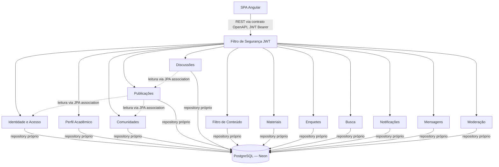
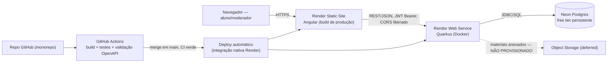
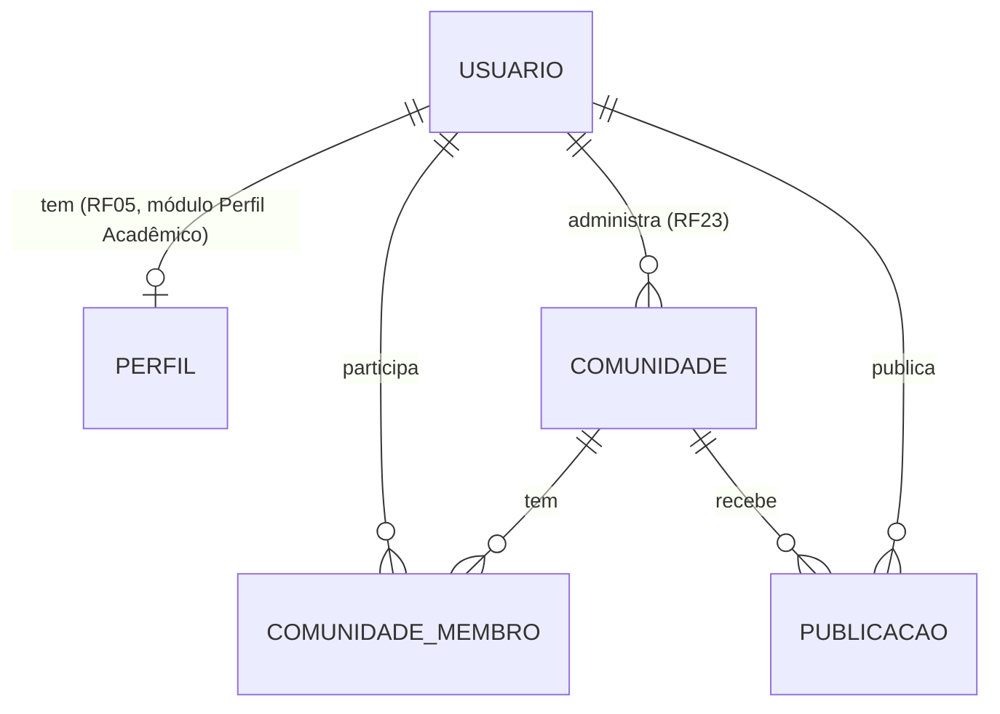

# Architecture Spine — UniCatólica

## Design Paradigm

**Monólito multimodular** — um único deploy unit Quarkus, um módulo por área funcional (Identidade e Acesso, Perfil Acadêmico, Comunidades, Publicações, Discussões, Filtro de Conteúdo, Materiais, Enquetes, Busca, Notificações, Mensagens, Moderação), cada um implementado como **JAX-RS Resource → Service → Repository**, todos atrás de um único filtro de segurança JWT. Frontend é uma SPA Angular, single deploy unit à parte. `[ADOPTED]` — stack e paradigma validados com o orientador (ver AD-1).

## Invariants & Rules



### AD-1 — Stack e estilo arquitetural `[ADOPTED]`

- **Binds:** todo o sistema
- **Prevents:** divergência de linguagem/framework entre módulos ou entre frontend e backend
- **Rule:** Frontend Angular/TypeScript; backend Java + Quarkus + Hibernate ORM; monólito multimodular (não microsserviços); TDD+SOLID; DDD focado no núcleo de interação de comunidade. Validado com o orientador (`docs/unicatolica-pacext-contexto.md` §5–6) — não é uma decisão em aberto deste spine. TDD é mecanicamente reforçado pelo gate de CI (AD-8: sem suite de testes passando, sem merge); SOLID e DDD são disciplina de design, não verificada automaticamente — dependem de revisão de código, que este time optou por não tornar obrigatória (AD-8).

### AD-2 — Filtro de segurança JWT `[ADOPTED]`

- **Binds:** todos os 12 módulos (RF08, RF09, RF13)
- **Prevents:** cada módulo implementando autenticação/autorização de um jeito diferente
- **Rule:** um único filtro JAX-RS intercepta toda requisição autenticável e valida o token JWT antes de encaminhar a qualquer componente de módulo — exceto os endpoints explicitamente marcados `@PermitAll` (ex.: `POST /auth/login`, `POST /auth/registro`), cuja lista vive só no próprio filtro como allowlist única, nunca espalhada por módulo. Transporte exclusivamente via header `Authorization: Bearer` — nunca cookie. Claims fixos no token: `sub` (id do usuário) e `roles` (perfis globais, RF13) — nenhum módulo inventa nome de claim próprio. Autorização fina por perfil (RF13) é responsabilidade de cada módulo consumidor, não do filtro; papel de administrador de comunidade (escopo local, RF23/RF29–31) é um eixo independente do perfil global — nenhuma funcionalidade da semana 1 exige compor os dois eixos (regra de composição futura em Deferred). CORS é configurado uma única vez, de forma centralizada (`quarkus.http.cors`), nunca por filtro de módulo individual.

### AD-3 — Limites de módulo dentro do monólito

- **Binds:** todos os 12 módulos
- **Prevents:** um módulo escrevendo direto na tabela de outro; acoplamento que impede separar em serviços no futuro
- **Rule:** cada módulo é dono das próprias tabelas (mapa componente→requisitos, `docs/unicatolica-pacext-contexto.md` §6.3). Leitura entre módulos via associação JPA é permitida, mas **somente-leitura ao nível de transação** — entidade projetada/DTO ou sessão em `FlushMode.MANUAL`, nunca a entidade gerenciável completa do módulo dono, pra uma mutação acidental não vazar como escrita não autorizada via dirty-checking do Hibernate. Escrita em dado de outro módulo só através de uma interface Java publicada pelo módulo dono (não "o `Service`" genericamente) — essa interface segue a mesma disciplina de acordo-antes-de-implementar da AD-4. Acesso direto a repositório/tabela alheios é proibido. Como não há revisão humana obrigatória (AD-8), essa regra é verificada por um teste de arquitetura automatizado na esteira de CI (ex.: ArchUnit) que falha o build se um pacote de módulo importar o `Repository` de outro módulo.

### AD-4 — Contrato OpenAPI-first

- **Binds:** todos os endpoints REST (RNF08)
- **Prevents:** frontend e backend divergindo de contrato ao avançar em paralelo sem revisão humana obrigatória (ver AD-8)
- **Rule:** `openapi.yaml` (OpenAPI 3.1.0, fixado por RNF08 — não uma escolha em aberto desta arquitetura) na raiz do repo é a fonte de verdade, acordada entre frontend e backend antes de qualquer lado implementar um endpoint novo. Validação de contrato em CI não se limita à compilação de interface gerada (que só pega divergência de rota/assinatura) — inclui um teste de contrato em tempo de execução por endpoint da semana 1, validando o corpo da resposta real contra o schema do `openapi.yaml` (ex.: `rest-assured` + validador de JSON Schema). Todo endpoint de listagem usa o mesmo envelope de paginação, fixado como componente compartilhado `PageResponse` no `openapi.yaml` e referenciado (`$ref`) por cada módulo — nenhum endpoint inventa a própria forma de paginar. Edição concorrente do próprio `openapi.yaml` por dois PRs em paralelo não tem trava além do CI — risco aceito conscientemente pelo time (ver Deferred).

### AD-5 — Envelope de erro padrão

- **Binds:** todos os endpoints REST
- **Prevents:** 4 pessoas inventando 4 formatos de erro diferentes entre módulos
- **Rule:** toda resposta de erro segue `{"error": {"code", "message", "details"}}` + status HTTP mapeado por cenário, não por escolha individual de módulo: `401` sem autenticação; `403` autenticado mas sem permissão para uma ação cujo recurso não precisa ter a existência escondida; `404` quando a própria existência do recurso deve ficar oculta a quem não tem acesso (ex.: comunidade privada da qual não é membro); `400`/`422` validação de entrada; `409` conflito de estado; `500` erro não tratado. Nenhum módulo escolhe 403 vs. 404 por conta própria para o mesmo tipo de cenário.

### AD-6 — Hosting e CORS

- **Binds:** deploy de frontend e backend
- **Prevents:** escolha ad-hoc de hosting por pessoa/módulo; perda de dados por expiração de banco gratuito
- **Rule:** Angular publicado como Render Static Site (build de produção, CDN gratuito); Quarkus como Render Web Service via Docker; PostgreSQL gerenciado no **Neon** (free tier persistente) — **nunca** o Postgres gratuito do próprio Render, que expira em 30 dias + 14 dias de carência antes de apagar os dados. CORS é configurado centralmente no backend (ver AD-2), liberando exatamente a origem do Static Site — nunca por filtro/módulo individual.

### AD-7 — Ambiente local reprodutível

- **Binds:** setup de desenvolvimento de todo o time
- **Prevents:** "na minha máquina funciona"
- **Rule:** `docker-compose.yml` na raiz do repo sobe Postgres (versão compatível com o Neon) + Quarkus em dev mode + Angular dev server, com `.env.example` compartilhado. Nenhum dev instala Postgres localmente fora do compose.

### AD-8 — Pipeline de CI/CD e gate de merge

- **Binds:** todo merge em `main`
- **Prevents:** código quebrado em `main`; deploy manual inconsistente
- **Rule:** GitHub Actions roda build + testes automatizados (frontend e backend) + validação do contrato OpenAPI (AD-4) em todo PR. Merge em `main` exige CI verde — sem revisão humana obrigatória (decisão do time, dado o prazo e o tamanho do grupo). Merge em `main` dispara deploy automático no Render via integração nativa GitHub↔Render.

### AD-9 — Migrations de schema

- **Binds:** PostgreSQL/Neon
- **Prevents:** alteração manual de schema em produção; divergência entre bancos locais dos devs
- **Rule:** Liquibase changelogs versionados no repo (extensão nativa do Quarkus). Schema de produção nunca é alterado manualmente. Um arquivo de changelog por módulo (`db/changelog/{modulo}/*.xml`), incluído por um changelog mestre estável via `<includeAll>` — o mestre não é editado a cada PR, então dois módulos não competem pela mesma linha. Changeset id prefixado pelo nome do módulo (ex.: `comunidades-002-add-campo`), nunca um contador global compartilhado — evita colisão entre PRs paralelos por construção, não por disciplina.

### AD-10 — Observabilidade e operação mínima

- **Binds:** todo o sistema em produção
- **Prevents:** sistema no ar sem visibilidade de saúde/erro; ausência total de estratégia de ambiente/backup
- **Rule:** backend expõe health check via `quarkus-smallrye-health` (`/q/health`), usado pelo Render pra decidir se a instância está saudável. Logs estruturados (JSON) para stdout — capturados nativamente pelos logs do Render, sem ferramenta de APM dedicada na semana 1. Backup do banco depende do que o plano gratuito do Neon já oferece por padrão, não configurado à parte por este spine (ver Deferred). Ambientes: local (`docker-compose`, AD-7) e produção (Render) — sem staging na semana 1, por custo/tempo.

### AD-11 — Log de auditoria transversal

- **Binds:** todos os módulos (RNF07)
- **Prevents:** cada módulo reinventando a própria tabela de auditoria isoladamente, quebrando a trilha única exigida por RNF07
- **Rule:** tabela `log_auditoria` única e compartilhada, gravada exclusivamente através de um `AuditoriaService` injetável — infraestrutura transversal, não pertence a nenhum dos 12 módulos de domínio. Todo módulo que precisa registrar um evento de auditoria (login, denúncia, remoção de conteúdo, alteração administrativa) injeta esse serviço; nenhum módulo escreve na tabela diretamente nem cria a própria tabela de log. Ativo desde a semana 1 (login via Identidade, alteração administrativa de comunidade via Comunidades).

## Consistency Conventions

| Concern | Convention |
| --- | --- |
| Naming (entidades, tabelas, colunas) | Português, seguindo a linguagem ubíqua do domínio já usada no modelo de dados de enquetes do contexto (`enquete_participacao`, `enquete_voto`) — DDD exige que o modelo espelhe o vocabulário do negócio. Classes técnicas (`Resource`, `Service`, `Repository`) e paths REST em inglês, por convenção Java/JAX-RS. |
| Data & formats (ids, datas, erros, campos JSON) | Chaves primárias `bigint`/identity do Postgres (não UUID — sem necessidade de geração distribuída nesta escala). Instantes (criação/edição) em ISO-8601 UTC (`Instant`, padrão Quarkus/Jackson); valores só-data (ex.: data de nascimento) usam `LocalDate`, sem conversão de fuso — nunca `Instant` pra data sem hora. Campos JSON de request/response em **camelCase, português** (`nomeCompleto`, não `name`) — mesma língua do modelo de domínio, sem camada de tradução extra. Erros seguem o envelope e o mapa de cenário da AD-5. |
| State & cross-cutting (mutação, logging, config, auth) | Mutação de dados de um módulo só pela interface publicada do módulo dono (AD-3). Autenticação garantida pelo filtro JWT global (AD-2); autorização fina por perfil (RF13) é responsabilidade de cada módulo, não do filtro. Log de auditoria centralizado na AD-11 (RNF07). Segredos/config via variáveis de ambiente (Render env vars / `.env` local) — nunca commitados (RNF04/OWASP ASVS). |

## Stack

| Name | Version |
| --- | --- |
| Angular | ^22 (estável, jun/2026) |
| Java | 21 LTS |
| Quarkus | 3.33 LTS (mar/2026 — suporte até mar/2027) |
| Hibernate ORM | gerenciado pelo BOM do Quarkus |
| Liquibase | via extensão `quarkus-liquibase` |
| PostgreSQL | conforme provisionado pelo Neon |
| OpenAPI | 3.1.0 (RNF08) |
| Docker | build/deploy do backend |
| GitHub Actions | CI |
| Render | Static Site (frontend) + Web Service (backend) |
| Neon | Postgres gerenciado |

## Structural Seed



`[ASSUMPTION]` — monorepo não foi decidido explicitamente pelo time nesta sessão; é a recomendação desta arquitetura dado o split frontend/backend horizontal e o contrato OpenAPI como costura única (uma mudança de contrato cabe em um PR só, um `docker-compose up` sobe tudo). Revisitar se o time achar confuso na prática.

```text
unicatolica/
  frontend/              # SPA Angular
  backend/                # Quarkus — pacote por módulo: identidade, perfil, comunidades,
                           # publicacoes, discussoes, filtro, materiais, enquetes, busca,
                           # notificacoes, mensagens, moderacao (AD-3)
  openapi.yaml             # contrato REST, fonte de verdade (AD-4)
  docker-compose.yml       # ambiente local reprodutível (AD-7)
  .env.example
  .github/
    workflows/              # pipeline CI (AD-8)
```



ERD cobre só a fatia da semana 1 (Identidade, Perfil, Comunidades, Publicações). Discussão/Comentário, Enquete (com o split `enquete_participacao`/`enquete_voto` já travado em `docs/unicatolica-pacext-contexto.md` §3.8 — não redesenhado aqui), Notificação, Mensagem e Denúncia existem no domínio completo mas ficam fora deste diagrama por estarem em módulos deferidos.

## Deferred

- **Stretch goal da semana 1** (não bloqueiam a entrega, entram se sobrar tempo): Perfil Acadêmico completo (RF14–RF20, além do perfil padrão do cadastro) e Discussões com encadeamento de respostas (RF37–RF42) — mesma arquitetura (AD-1 a AD-11) já se aplica, é só questão de sequência.
- **Módulos totalmente fora do corte da semana 1**: Filtro de Conteúdo, Materiais, Enquetes, Busca, Notificações, Mensagens, Moderação — os mesmos AD-1 a AD-11 se aplicam quando forem construídos; revisitar o corte de escopo depois que a fatia núcleo estiver no ar.
- **RF75.1–75.3 (agente de IA de triagem de moderação)** — exigência formal do orientador, sem desenho de integração ainda (onde roda, síncrono ou assíncrono, fonte da blacklist) — precisa de uma passada de design própria antes de Moderação ser construído.
- **RNF05/LGPD para módulos futuros que tocam dado pessoal** (Enquetes, Mensagens, Moderação) — seguem o padrão de anonimização já travado em `docs/unicatolica-pacext-contexto.md` §3.8 (split `enquete_participacao`/`enquete_voto`); não redesenhado aqui porque esses módulos estão fora do corte da semana 1.
- **Storage de arquivos para Materiais (RF48–52)** — o C4 nível 2 do contexto cita "Sistema de arquivos / Object Storage" genericamente; disco do Render free tier é efêmero, então isso exige uma escolha real de object storage (ex.: S3-compatível) — não escolhida aqui.
- **Latência de "acordar" em free tier — risco direto pra RNF03 (p95 ≤ 2s)**: Render free tier hiberna a instância após 15 min de inatividade (~1 min pra acordar, teto de 750h/mês); Neon escala a computação a zero após 5 min ocioso — mesma categoria de latência de "religar". Aceitável para desenvolvimento e demo avisada; risco real de estourar RNF03 numa demonstração ao vivo sem aviso ou numa medição formal do NFR. Revisitar (upgrade pro tier pago do Render, manter o Neon "aquecido") antes de qualquer demo/avaliação de alto risco.
- **Colisão de edição concorrente em `openapi.yaml`** (achado da revisão adversarial) — o time optou conscientemente por manter o merge CI-only também para esse arquivo, sem exceção de aprovação obrigatória. Risco aceito; revisitar se um incidente real de contrato quebrado em produção acontecer.
- **Ambiente de staging** — não existe na semana 1 (custo/tempo); só local (AD-7) e produção (Render). Revisitar se o cronograma permitir.
- **Backup/point-in-time recovery do banco** — depende do que o plano gratuito do Neon já oferece por padrão; não verificado/configurado à parte por este spine.
- **Java 21 LTS vs. Java 25 LTS** — Quarkus 3.33 já suporta Java 25 integralmente; ficou em 21 por maturidade de tooling/tutoriais pra um time estreando implementação, não por limitação técnica do Quarkus. Upgrade de JDK é trivial nesse stack, revisitável a qualquer momento sem custo arquitetural.
- **Breakpoints responsivos e modo escuro** seguem como pendência aberta em `EXPERIENCE.md`/`DESIGN.md` — não bloqueiam o build estático do frontend.
- **Monorepo vs. multi-repo** — ver `[ASSUMPTION]` na Structural Seed acima.
