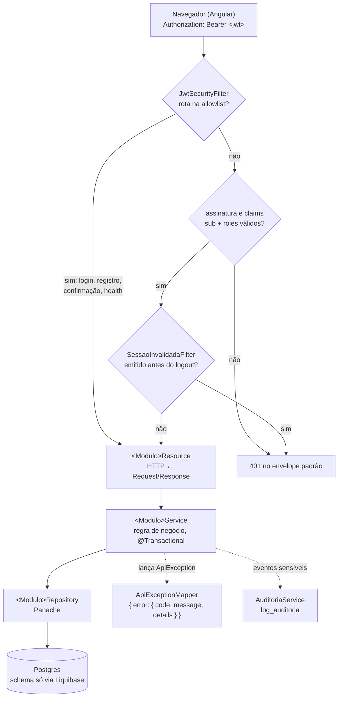

# Como o UniCatólica funciona

Guia de entrada para quem vai ler ou escrever código. Explica o caminho de uma requisição, onde cada coisa mora e onde colocar código novo. As decisões e o porquê de cada uma estão em [`arquitetura.md`](arquitetura.md) (AD-1 a AD-11); este documento só descreve como elas aparecem no código.

> **Em transição.** O time decidiu reestruturar o código para que todos os módulos sigam o mesmo formato (ver [`decisoes/2026-09-24-reestruturacao.md`](decisoes/2026-09-24-reestruturacao.md)). Onde o código de hoje ainda difere do alvo, a seção marca **Hoje** e **Alvo**. Código novo já segue o **Alvo**.

## 1. Visão de 30 segundos

- **Um backend só** (Quarkus, Java 21), dividido em módulos por área de negócio: `identidade`, `comunidades`, `publicacoes`...
- **Um frontend só** (Angular), que conversa com o backend por REST/JSON.
- **Um contrato** entre os dois: [`openapi.yaml`](../openapi.yaml). Endpoint novo nasce no contrato antes do código (AD-4).
- **Um banco** Postgres. Cada módulo é dono das próprias tabelas, e o schema só muda por Liquibase (AD-9).

## 2. O caminho de uma requisição



Passo a passo:

1. **O frontend manda o token** no header `Authorization: Bearer <jwt>`, nunca em cookie (AD-2). O token fica em `localStorage` e é montado por `AuthService.authHeaders()` (`frontend/src/app/core/auth/auth.service.ts`). Ainda não existe `HttpInterceptor` global.
2. **`JwtSecurityFilter`** (`compartilhado/seguranca/`) roda antes de tudo. Rotas da allowlist passam direto: `/auth/login`, `/auth/registro`, `/auth/confirmacao-email/**`, `/q/health/**`. As demais precisam de um token válido com as claims `sub` (id do usuário) e `roles` (perfil global); sem isso, a resposta é 401.
3. **`SessaoInvalidadaFilter`** rejeita tokens emitidos antes do último logout do usuário. É um filtro separado só porque consulta o banco, e o primeiro filtro roda numa thread onde isso não é permitido.
4. **O `Resource`** recebe o HTTP, converte o JSON em `*Request` e chama o `Service`. Não tem regra de negócio.
5. **O `Service`** aplica a regra de negócio, abre a transação, grava auditoria quando o evento é sensível e lança `ApiException` quando algo é recusado.
6. **O `Repository`** (Panache) lê e grava só as tabelas do próprio módulo.
7. **Erros** viram sempre `{"error": {"code", "message", "details"}}`, com status 400/401/403/404/409/422/500 conforme o cenário (AD-5). Use 404 quando a própria existência do recurso deve ficar oculta, e 403 quando não precisa.

### Quem é o usuário da requisição?

Injete `UsuarioAutenticado` e use `id()` e `possuiPerfil("MODERADOR")`. A autorização fina ("só o criador pode editar") é decidida no módulo, nunca no filtro.

Fica em `compartilhado/seguranca/UsuarioAutenticado`. Se a claim `sub` não puder ser lida, `id()` lança `ApiException` 401 `NAO_AUTENTICADO`.

## 3. Onde cada coisa mora (backend)

Raiz: `backend/src/main/java/br/edu/unicatolica/pacext/`

### Transversal

Código que todos os módulos usam e que não pertence a nenhum.

| Assunto | Onde |
|---|---|
| Filtros de autenticação, `UsuarioAutenticado` | `compartilhado/seguranca/` |
| Erro (`ApiException`, `ErroResponse`, mappers) | `compartilhado/erro/` (todos; nenhum módulo tem mapper próprio) |
| Paginação (`PageResponse`) | `compartilhado/paginacao/` |
| Auditoria (`AuditoriaService`) | `compartilhado/auditoria/` |
| E-mail (`EmailService`) | `compartilhado/email/` |

A migration de `log_auditoria` continua em `db/changelog/modulos/infraestrutura/`, com o id `infraestrutura-001-...`. O Liquibase identifica um changeset pelo caminho do arquivo, então renomear a pasta faria o banco de produção tentar criar a tabela de novo. Migrations novas do transversal vão em `modulos/compartilhado/`.

### Dentro de um módulo

Todo módulo segue o mesmo formato (**Alvo**; hoje só `identidade/` está perto dele):

```
<modulo>/
  <Interface>.java   raiz: SÓ interfaces que outros módulos podem usar
  web/               *Resource, *Request, *Response
  aplicacao/         *Service (+ implementação das interfaces da raiz)
  dominio/           entidades, enums, *Repository, exceções (subclasses de ApiException)
```

- **Hoje, `comunidades/`** deixa entidades, Services e Repositories na raiz e só separa `web/`.

### Estado dos módulos

| Módulo | Estado |
|---|---|
| `identidade` | Cadastro, confirmação de e-mail, login, logout, `GET /usuarios/me` e `/usuarios/{id}` |
| `comunidades` | Auto-join por curso, criar comunidade aberta, entrar/sair, listar/filtrar |
| `publicacoes` | Em desenvolvimento (Story 3.x) |
| `perfil`, `discussoes`, `filtro`, `materiais`, `enquetes`, `busca`, `notificacoes`, `mensagens`, `moderacao` | Só `package-info.java`; ainda sem código |

## 4. As regras que mantêm os módulos separados

1. **A raiz do módulo é a API pública.** Outro módulo só importa o que está na raiz. Exemplo: `comunidades` escuta o evento `identidade.UsuarioCadastrado` (`@Observes`) para colocar o aluno na comunidade do curso; nunca importa `identidade.dominio.Usuario`. `identidade` é módulo folha: não importa nenhum outro módulo, e avisa por evento CDI quando algo que interessa aos outros acontece. O observer síncrono roda na mesma transação de quem dispara.
2. **O Resource só chama o Service**, nunca o Repository.
3. **Erro tem um só caminho:** lançar `ApiException` (fábricas `validacao`, `naoAutenticado`, `semPermissao`, `naoEncontrado`, `conflito`) ou uma subclasse dela. O `Resource` nunca monta `ErroResponse` à mão.
   - Exceção de domínio com nome próprio (ex.: `CredenciaisInvalidasException`) estende `ApiException` e passa status, código e mensagem no construtor.
   - **Filtros:** `JwtSecurityFilter` e `SessaoInvalidadaFilter` não lançam exceção (usam `abortWith`). Montam o 401 por `RespostasErro.naoAutenticado(detalhes)`, nunca com `ErroResponse.of` direto.
4. **O transversal não importa nenhum módulo.** Quando precisa de dado de um módulo, declara uma interface que o módulo implementa. Exemplo: `SessaoInvalidadaFilter` usa `compartilhado.seguranca.SessaoConsulta`, implementada por `identidade.aplicacao.UsuarioService`.
5. **Referência a dado de outro módulo é só pelo id.** Exemplo: `comunidade_membro.usuario_id` é um `Long`, sem relação JPA nem FK para `usuario` (AD-3). Para exibir nome ou curso, use `identidade.UsuarioConsulta.buscarResumos(ids)`, que busca em lote (sem N+1).
6. **Auditoria só pelo `AuditoriaService`.** Nenhum módulo escreve direto em `log_auditoria` (AD-11).

As regras 1, 2 e 4, e a regra "`identidade` não importa nenhum outro módulo", são verificadas por `ArquiteturaTest` (ArchUnit) no CI. As violações que já existiam ficam em `EXCECOES_TEMPORARIAS`, cada uma com o PR que a remove; o teste também falha quando uma exceção deixa de ser necessária, então a lista só diminui. Nunca adicione uma exceção nova: corrija o código.

## 5. Banco e migrations

- Um changelog por módulo em `backend/src/main/resources/db/changelog/modulos/<modulo>/`.
- Nome do arquivo e id do changeset: `<modulo>-NNN-descricao` (ex.: `comunidades-002-seed-comunidades-curso`). Nunca um contador global (AD-9).
- O mestre `db.changelog-master.xml` inclui tudo com `includeAll`. Não edite o mestre por PR.
- Seeds só de desenvolvimento usam `context="dev"`, que nunca roda em produção.
- Convenções: tabela/coluna em português, id `bigint` identity, `Instant` para timestamp e `LocalDate` para data sem hora.

## 6. Frontend

Raiz: `frontend/src/app/`

| Pasta | Conteúdo |
|---|---|
| `core/` | O que o app inteiro usa: `auth/` (service, guard), `config/api.config.ts` |
| `layout/` | `shell` (casca autenticada com sidebar) e `auth-shell` (telas públicas) |
| `ui/` | Design system Campus Clean (button, card, badge, toast, member-indicator), exportado por `ui/index.ts` |
| `features/<modulo>/` | Telas de cada módulo |

- **Hoje:** `cadastro/` e `confirmar-email/` estão soltos na raiz de `app/`, e os serviços HTTP de módulo ficam em `core/comunidades/` e `core/usuario/`.
- **Alvo:** tudo de identidade em `features/identidade/`, e o serviço HTTP de cada módulo ao lado das telas dele.

**Estilo:** use só os tokens `var(--uc-*)` e as classes `.uc-text-*`. Um hex, px ou fonte literal quebra o build (`scss-guard.spec.ts`). Veja `frontend/src/styles/README.md`.

**Rotas:** `app.routes.ts`. As públicas ficam no topo; as autenticadas ficam dentro do `shell`, protegidas por `authGuard`.

## 7. Checklist: nova funcionalidade

1. **Contrato:** adicione o endpoint e os schemas em `openapi.yaml`. Listagem usa `$ref` para `PageResponse`, e erro usa o envelope padrão.
2. **Migration:** `<modulo>-NNN-descricao.xml` na pasta do módulo.
3. **Domínio:** entidade e `*Repository` em `<modulo>/dominio/`.
4. **Regra:** `*Service` em `<modulo>/aplicacao/`, com teste unitário (JUnit + Mockito, sem subir o Quarkus; ver `ComunidadeServiceTest`).
5. **HTTP:** `*Resource` e DTOs em `<modulo>/web/`, com teste `@QuarkusTest` + rest-assured (ver `AuthResourceTest`).
6. **Outro módulo precisa disso?** Exponha uma interface na raiz do módulo, nunca o Repository.
7. **Frontend:** tela em `features/<modulo>/`, usando os componentes de `ui/`, com teste Vitest ao lado (`*.spec.ts`).
8. **PR:** abra, espere os 3 checks (Frontend, Backend, Contrato) e faça squash merge.

## 8. Rodando localmente

Pré-requisitos: Docker rodando, JDK 21 e Node 24, o mesmo do CI (`nvm use` lê o `.nvmrc`).

```bash
./scripts/dev-setup.sh                  # uma vez: .env, chaves JWT, link backend/.env
cd backend && ./mvnw quarkus:dev        # Quarkus :8080 (/q/health), debug :5005
cd frontend && npm ci && npm start      # Angular :4200
```

O Postgres sobe sozinho pelo Quarkus Dev Services, tanto no `quarkus:dev` quanto no `./mvnw test`. O banco de dev é descartado ao parar o Quarkus, e o seed do contexto `dev` recria os dados de teste a cada subida. Para usar um banco persistente (ex.: o `db` do compose), defina `QUARKUS_DATASOURCE_JDBC_URL=jdbc:postgresql://localhost:5432/pacext` no `.env`.

Sem nada instalado além do Docker, `docker-compose up` continua subindo tudo junto (Postgres :5432, Quarkus :8080, Angular :4200), só que mais devagar.

| O quê | Comando |
|---|---|
| Testes do backend | `cd backend && ./mvnw test` |
| Testes do frontend | `cd frontend && npx ng test --watch=false` |
| E2E (Playwright) | `cd frontend && npm run e2e` |
| Lint do contrato | `npx --yes @redocly/cli lint openapi.yaml` |
