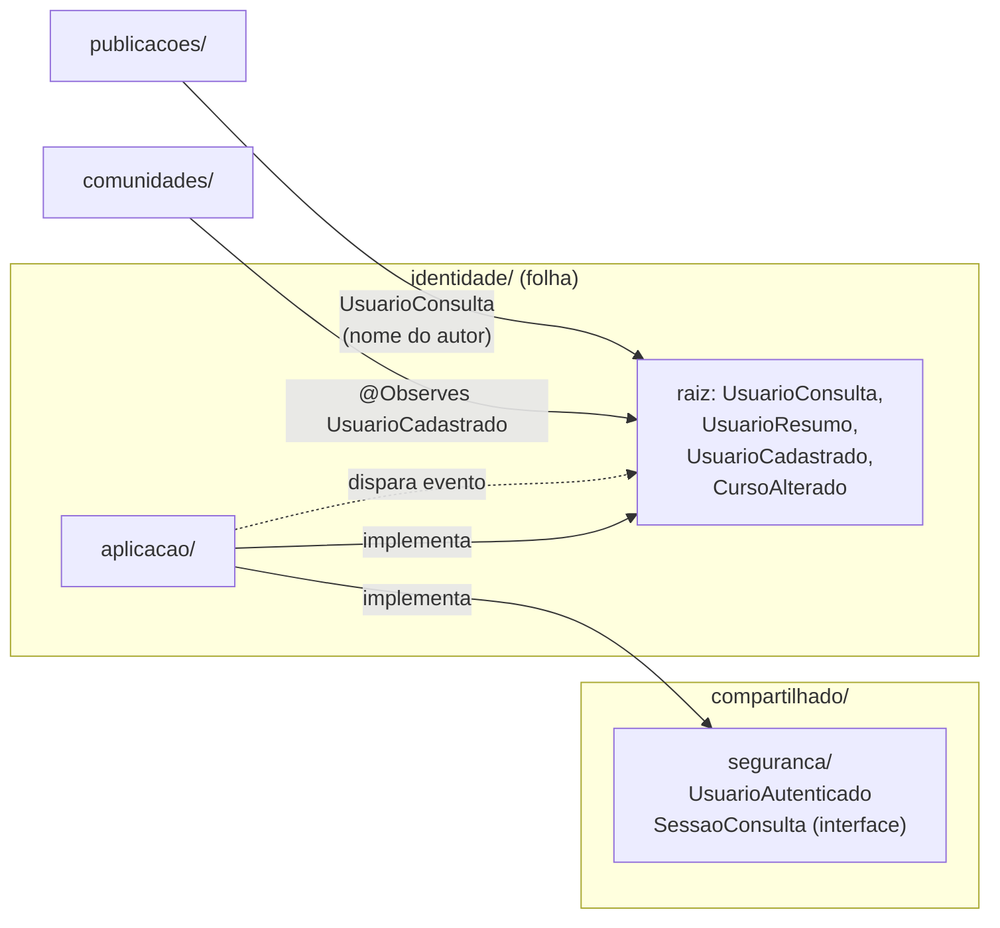

# Decisão: Identidade desacoplada no monólito e ambiente local sem compose

- **Data:** 2026-09-24
- **Estado:** aceita
- **Complementa:** [`2026-09-24-reestruturacao.md`](2026-09-24-reestruturacao.md)
- **Arquitetura (AD-1 a AD-11):** sem alteração; AD-7 ganha um modo de desenvolvimento mais leve

## Contexto

A ideia de extrair Identidade para um serviço próprio nasceu de uma necessidade prática: ganhar agilidade para desenvolver, manter e entender o código. Duas coisas atrapalham isso hoje, e são problemas diferentes.

**1. O ambiente local é lento.** `docker-compose up` sobe 3 containers:

| Causa | Onde |
|---|---|
| `npm ci` roda a cada `up` | serviço `frontend` |
| O frontend espera o backend ficar saudável (`start_period: 60s`) | `depends_on` |
| Maven e Quarkus rodam dentro do container, com bind mount (live reload mais lento que no host) | serviço `backend` |
| Sem `JWT_*` no `.env`, a chave fica em memória e muda a cada reinício: o login se perde | `.env` |
| `node_modules` é compartilhado entre o container (Alpine, musl) e o host (glibc), então os binários nativos (esbuild, sass) quebram quando se alterna entre os dois | volume `./frontend` |

**2. Identidade conhece os outros módulos, e os outros a conhecem por dentro:**

| Acoplamento | Onde |
|---|---|
| Identidade chama Comunidades | `CadastroService` importa `comunidades.AutoJoinCursoService` |
| O transversal lê a tabela de Identidade | `SessaoInvalidadaFilter` importa `identidade.dominio.UsuarioRepository` |
| Outros módulos importam um pacote interno de Identidade | `ComunidadeResource` importa `identidade.infraestrutura.UsuarioAutenticado` |

Extrair Identidade para outro processo não resolve o problema 1: aumenta o número de serviços, adiciona chamadas HTTP entre eles, distribui a chave JWT e cria um segundo deploy. **Desacoplar** e **separar em outro processo** são decisões independentes.

## Decisão

### A. Desenvolvimento local sem compose (PR 0)

O dia a dia passa a rodar no host; o compose continua funcionando para quem quiser subir tudo junto.

1. **Postgres por Quarkus Dev Services.** A `jdbc.url` só é fixa em `%prod`. Em dev e teste, sem URL configurada, `./mvnw quarkus:dev` e `./mvnw test` sobem um Postgres 16 sozinhos via Testcontainers (precisa só do Docker rodando). O CI passa a usar o mesmo mecanismo, sem `services: postgres`.
2. **Banco externo continua possível:** quem quiser dados persistentes ou usar o Postgres do compose define `QUARKUS_DATASOURCE_JDBC_URL` no `.env`.
3. **`scripts/dev-setup.sh`:** cria o `.env` a partir do `.env.example`, gera o par de chaves JWT uma única vez e liga `backend/.env` ao `.env` da raiz, porque o Quarkus lê o `.env` do diretório onde roda.
4. **`.nvmrc`** na raiz e em `frontend/` com Node 24, o mesmo do CI (o Angular CLI 22 exige 22.22.3+ ou 24.15+).
5. **Compose mais rápido:** `npm ci` só quando o `package-lock.json` muda, `node_modules` do container em volume próprio, e o frontend não espera mais o backend.

Fluxo diário:

```bash
./scripts/dev-setup.sh                 # uma vez
cd backend && ./mvnw quarkus:dev       # Postgres sobe sozinho; debug pela IDE na 5005
cd frontend && nvm use && npm start    # :4200
```

### B. Identidade como módulo folha (PRs 3, 5 e 5b)

Identidade passa a depender só de `compartilhado/`. Os outros módulos a usam apenas pela API pública, na raiz do pacote.



1. **Evento CDI no lugar da chamada direta.** `CadastroService` dispara `identidade.UsuarioCadastrado(usuarioId, curso)` com `Event<UsuarioCadastrado>`; Comunidades escuta com `@Observes` e chama o próprio `AutoJoinCursoService`. O observer síncrono roda na mesma transação, então uma falha no auto-join continua desfazendo o cadastro, como hoje. A troca de curso (Epic 4) segue o mesmo padrão com `CursoAlterado(usuarioId, cursoAnterior, cursoNovo)`.
2. **`SessaoConsulta`** (interface em `compartilhado/seguranca`, implementada em `identidade/aplicacao`) substitui o acesso do filtro ao `UsuarioRepository`. Já previsto no PR 5.
3. **`UsuarioAutenticado`** vai para `compartilhado/seguranca`. Já previsto no PR 3.
4. **`UsuarioConsulta`** na raiz de Identidade, para leitura por outros módulos: `buscarResumos(Collection<Long> ids)` devolve `UsuarioResumo(id, nome, curso)`. É uma consulta em lote, para que uma lista de publicações não gere N+1. Os outros módulos guardam só o `usuario_id`, sem FK nem relação JPA.
5. **ArchUnit:** além das regras 1, 2 e 4 da reestruturação, a regra "`identidade` não importa nenhum outro módulo".
6. **`identidade/package-info.java`** documenta o contrato do módulo: API pública, eventos que dispara e tabelas próprias.

**Não fazer agora:** separar Identidade em um módulo Maven próprio. Daria garantia em tempo de compilação, mas complica o build e o CI, e o ArchUnit já cobre quase o mesmo.

## Execução

| PR | Conteúdo |
|---|---|
| 0 | Frente A inteira: Dev Services, `dev-setup.sh`, `.nvmrc`, compose mais rápido, CI sem `services: postgres`, docs de "rodando localmente" |
| 3 | (já previsto) `UsuarioAutenticado` para `compartilhado/seguranca` |
| 5 | (ampliado) `UsuarioService`, `SessaoConsulta` e `UsuarioConsulta` |
| 5b | Evento `UsuarioCadastrado` no lugar da chamada a `AutoJoinCursoService`; regra ArchUnit "identidade é folha"; `package-info` atualizado |

## Consequências

- Nenhuma rota, payload ou código de erro muda.
- Rodar local exige Docker (para o Dev Services), JDK 21 e Node 24 no host. O compose continua como alternativa sem nada instalado além do Docker.
- Em dev, o banco do Dev Services é descartado ao parar o Quarkus; o seed do contexto `dev` recria os dados de teste a cada subida.
- Se um dia a extração fizer sentido, a troca fica localizada: a implementação de `UsuarioConsulta` vira um cliente REST e o evento vira uma mensagem. Nenhum outro módulo muda.
