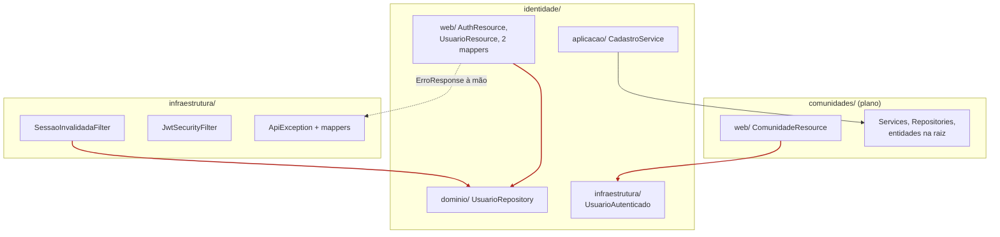
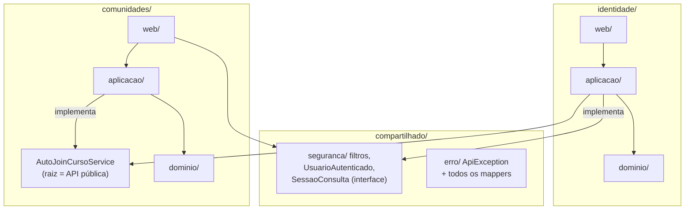

# Decisão: reestruturação do código e da documentação

- **Data:** 2026-09-24
- **Estado:** aceita
- **Base:** `main` @ `d58cec8`
- **Escopo:** backend, frontend, docs
- **Arquitetura (AD-1 a AD-11):** sem alteração

## Contexto

A arquitetura (monólito modular, Resource → Service → Repository, JWT, OpenAPI-first) continua adequada. O que dificulta entender o sistema é que o código aplica essa arquitetura de formas diferentes em cada lugar, e a documentação está espalhada:

1. Cada módulo tem um layout diferente: `identidade/` usa `web/aplicacao/dominio/infraestrutura`; `comunidades/` deixa tudo na raiz e só separa `web/`.
2. "infraestrutura" tem dois significados: o pacote raiz transversal e `identidade/infraestrutura/`.
3. A autenticação está espalhada em 3 lugares: filtros em `infraestrutura/seguranca`, `UsuarioAutenticado` em `identidade/infraestrutura`, `JwtSigningKeyProducer` em `identidade/aplicacao`.
4. Há 3 jeitos diferentes de devolver erro: `ApiException` com mapper, exceção com mapper próprio, e `ErroResponse.of` montado à mão em `AuthResource` e `UsuarioResource`.
5. `UsuarioResource` chama `UsuarioRepository` direto, pulando o Service.
6. `SessaoInvalidadaFilter`, que é transversal, depende de `identidade.dominio.UsuarioRepository`.
7. No frontend, `features/identidade/login/` existe, mas `cadastro/` e `confirmar-email/` ficam soltos na raiz de `app/`.
8. A documentação tinha o spine duplicado, doc viva misturada com histórico, e 9 módulos vazios só com `package-info.java`.

## Decisão

Cinco regras, cada uma com um só jeito de fazer:

1. A raiz do módulo é a API pública; outro módulo só importa o que está nela.
2. O Resource só chama o Service.
3. Erro tem um só caminho: `ApiException` ou uma subclasse dela. Nenhum `ErroResponse.of` fora de `compartilhado/erro`, nenhum mapper por módulo.
4. O transversal (`compartilhado/`, renomeado de `infraestrutura/`) não importa nenhum módulo. Quando precisa de dado de um módulo, declara uma interface que o módulo implementa (ex.: `SessaoConsulta`).
5. O pacote de um módulo só nasce quando a primeira story dele começa. A lista dos 12 módulos vive em [`../arquitetura.md`](../arquitetura.md), não em pastas vazias.

As regras 1, 2 e 4 são verificadas por ArchUnit no CI. O fluxo de requisição e a estrutura alvo detalhada estão em [`../como-funciona.md`](../como-funciona.md).

### Dependências: hoje

As setas vermelhas são as violações que a reestruturação remove.



### Dependências: depois



### Estrutura alvo

```
backend/src/main/java/br/edu/unicatolica/pacext/
  compartilhado/              # renomeado de infraestrutura/
    seguranca/   JwtSecurityFilter, SessaoInvalidadaFilter, UsuarioAutenticado
    erro/        ApiException, ErroResponse, todos os ExceptionMappers
    paginacao/   PageResponse
    auditoria/   AuditoriaService, LogAuditoria
    email/       EmailService
  <modulo>/
    <Interface>.java          # raiz: só interfaces públicas
    web/         *Resource, *Request, *Response
    aplicacao/   *Service
    dominio/     entidades, enums, *Repository, exceções

frontend/src/app/
  core/          auth, config
  layout/        shell, auth-shell
  ui/            design system Campus Clean
  features/
    identidade/  login/ cadastro/ confirmar-email/ identidade.service.ts
    comunidades/ lista/ detalhe/ comunidades.service.ts
    feed/

docs/
  README.md             # índice: comece por aqui
  como-funciona.md      # fluxo de requisição + onde colocar código novo
  arquitetura.md        # o spine (cópia única)
  decisoes/             # um arquivo por decisão daqui pra frente
  produto/              # PRD, contexto, UX, design
_bmad-output/           # histórico do planejamento, só leitura
  implementation-artifacts/historico/   # validacao-*, relatorio-status
```

## Pontos em aberto resolvidos

Três pontos que o plano original não cobria, decididos antes do PR 3.

### 1. Filtros de autenticação e a regra 3

`JwtSecurityFilter` e `SessaoInvalidadaFilter` não podem lançar `ApiException`: o primeiro é `@PreMatching` e roda na thread de I/O, e os dois encerram a requisição com `requestContext.abortWith(...)`. Hoje cada um monta `ErroResponse.of("NAO_AUTENTICADO", ...)` à mão, o que viola a regra 3 depois que eles forem para `compartilhado/seguranca`.

**Decisão:** o PR 4 cria em `compartilhado/erro/` um único ponto que monta a resposta 401 no envelope padrão (ex.: `RespostasErro.naoAutenticado(String detalhes): Response`), e os dois filtros passam a chamá-lo. O corpo e o status continuam idênticos; os testes de envelope existentes cobrem a troca.

### 2. `JwtSigningKeyProducer`, `PasswordHasher` e `GeradorTokenConfirmacao`

A chave privada só é usada por `AuthService`, que é o único ponto que emite token. A verificação (chave pública) já é do transversal, via `mp.jwt.verify.publickey`.

**Decisão:** os três ficam onde estão. `JwtSigningKeyProducer` fica em `identidade/aplicacao/`, porque emitir token é responsabilidade de Identidade e, se ela for extraída para um serviço próprio, a chave de assinatura vai junto. `PasswordHasher` e `GeradorTokenConfirmacao` ficam em `identidade/dominio/`. Só `UsuarioAutenticado` vai para `compartilhado/seguranca` (PR 3), porque todo módulo o injeta.

### 3. `HttpInterceptor` no frontend

A primeira versão da estrutura alvo colocava um `interceptor` em `core/`, mas hoje ele não existe (`AuthService.authHeaders()` monta o header em cada chamada) e a AD-7 não decidiu isso. Criar um mudaria comportamento, o que contradiz "PRs mecânicos".

**Decisão:** fora do escopo. O PR 7 só move arquivos e mantém `authHeaders()`. Um interceptor global, se o time quiser, vira decisão própria em `decisoes/` e PR separado.

## Execução

São 8 PRs mecânicos (mais o PR 0 e o 5b, da decisão [`2026-09-24-identidade-desacoplada.md`](2026-09-24-identidade-desacoplada.md)), sem mudança de comportamento. Cada PR passa no CI sozinho. Os PRs 3, 6 e 7 movem pacotes e precisam de uma janela combinada com o time, porque geram conflito com branches abertas.

| PR | Conteúdo | Risco | Estado |
|---|---|---|---|
| 0 | Ambiente local sem compose: Dev Services, `dev-setup.sh`, `.nvmrc` (ver [`2026-09-24-identidade-desacoplada.md`](2026-09-24-identidade-desacoplada.md)) | Baixo | Concluído (#22) |
| 1 | Documentação: índice, `como-funciona.md`, spine em cópia única, histórico para `_bmad-output` | Nenhum | Concluído (#21) |
| 2 | `ArquiteturaTest` (ArchUnit) com as regras 1, 2 e 4 e "identidade é folha", com exceções temporárias para as violações atuais; cada PR seguinte remove as suas | Baixo | Concluído (#23) |
| 3 | `infraestrutura` → `compartilhado`, com subpacotes; `UsuarioAutenticado` para `compartilhado/seguranca` | Baixo | Concluído (#24) |
| 4 | Erro único: exceções de domínio estendem `ApiException`; remover os 2 mappers do identidade e o `ErroResponse.of` dos Resources e dos filtros (ponto 1) | Médio | Em andamento |
| 5 | `UsuarioService` (Resource sem Repository), a interface `SessaoConsulta` e `UsuarioConsulta` | Baixo | Pendente |
| 5b | Evento CDI `UsuarioCadastrado` no lugar da chamada direta a `AutoJoinCursoService`; remove a última exceção de "identidade é folha" | Baixo | Pendente |
| 6 | `comunidades/` no formato `web/aplicacao/dominio` | Baixo | Pendente |
| 7 | Frontend: `cadastro/` e `confirmar-email/` para `features/identidade`; serviços ao lado das features (sem interceptor, ponto 3) | Baixo | Pendente |
| 8 | Remover os `package-info` vazios; conferir que `EXCECOES_TEMPORARIAS` ficou vazia; atualizar o `AGENTS.md` | Nenhum | Pendente |

## Consequências

- **Comportamento da API:** nenhuma rota, payload ou código de erro muda. Os testes de envelope existentes protegem o PR 4.
- **Publicações (spec 3.2):** o ideal é começar já no formato novo. Se for implementada antes, entra no PR 6 junto com `comunidades/`.
- **Extração do Identidade:** os PRs 2 a 5 cobrem boa parte da Fase 1 do plano de extração. A extração continua opcional e fica mais barata.
