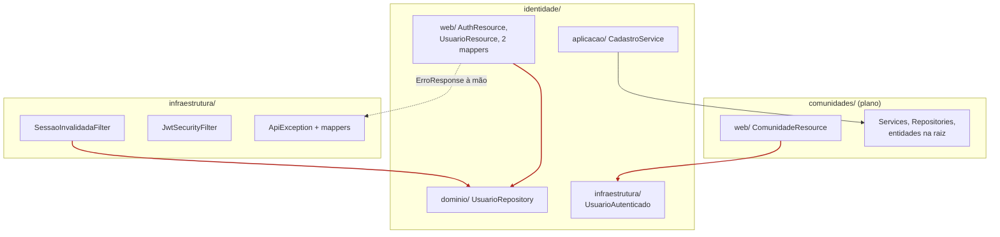
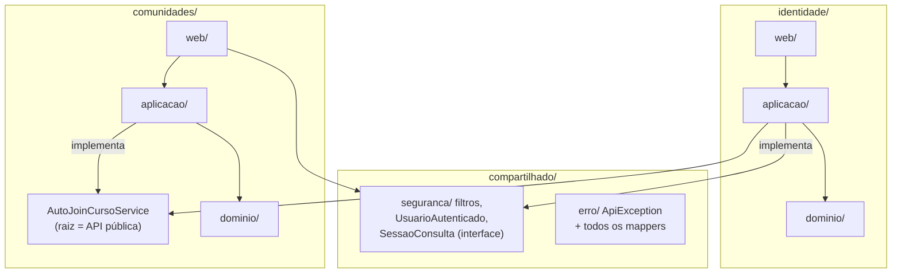

# Decisão: reestruturação do código e da documentação

- **Data:** 2026-09-24
- **Estado:** aceita
- **Base:** `main` @ `d58cec8`
- **Arquitetura (AD-1 a AD-11):** sem alteração

## Contexto

A arquitetura (monólito modular, Resource → Service → Repository, JWT, OpenAPI-first) continua adequada. O que dificulta entender o sistema é que o código aplica essa arquitetura de formas diferentes em cada lugar, e a documentação está espalhada:

1. Cada módulo tem um layout diferente: `identidade/` usa `web/aplicacao/dominio/infraestrutura`; `comunidades/` deixa tudo na raiz e só separa `web/`.
2. "infraestrutura" tem dois significados: o pacote raiz transversal e `identidade/infraestrutura/`.
3. A autenticação está espalhada entre `infraestrutura/seguranca`, `identidade/infraestrutura` e `identidade/aplicacao`.
4. Há 3 jeitos diferentes de devolver erro: `ApiException` com mapper, exceção com mapper próprio, e `ErroResponse.of` montado à mão no Resource.
5. `UsuarioResource` chama `UsuarioRepository` direto, pulando o Service.
6. `SessaoInvalidadaFilter`, que é transversal, depende de `identidade.dominio.UsuarioRepository`.
7. No frontend, `cadastro/` e `confirmar-email/` ficam fora de `features/identidade/`.
8. A documentação tinha o spine duplicado, doc viva misturada com histórico, e 9 módulos vazios só com `package-info.java`.

## Decisão

Cinco regras, cada uma com um só jeito de fazer:

1. A raiz do módulo é a API pública; outro módulo só importa o que está nela.
2. O Resource só chama o Service.
3. Erro tem um só caminho: `ApiException` ou uma subclasse dela.
4. O transversal (`compartilhado/`, renomeado de `infraestrutura/`) não importa nenhum módulo.
5. O pacote de um módulo só nasce quando a primeira story dele começa.

As regras 1, 2 e 4 são verificadas por ArchUnit no CI. O fluxo de requisição e a estrutura alvo detalhada estão em [`../como-funciona.md`](../como-funciona.md).

### Dependências: hoje

As setas vermelhas são as violações que a reestruturação remove.



### Dependências: depois



### Estrutura alvo

```
backend/src/main/java/br/edu/unicatolica/pacext/
  compartilhado/              # renomeado de infraestrutura/
    seguranca/   JwtSecurityFilter, SessaoInvalidadaFilter, UsuarioAutenticado
    erro/        ApiException, ErroResponse, todos os ExceptionMappers
    paginacao/   PageResponse
    auditoria/   AuditoriaService, LogAuditoria
    email/       EmailService
  <modulo>/
    <Interface>.java          # raiz: só interfaces públicas
    web/         *Resource, *Request, *Response
    aplicacao/   *Service
    dominio/     entidades, enums, *Repository, exceções

frontend/src/app/
  core/          auth, config
  layout/        shell, auth-shell
  ui/            design system Campus Clean
  features/
    identidade/  login/ cadastro/ confirmar-email/ identidade.service.ts
    comunidades/ lista/ detalhe/ comunidades.service.ts
    feed/

docs/
  README.md  como-funciona.md  arquitetura.md  decisoes/  produto/
_bmad-output/                 # histórico, só leitura
```

## Execução

São 8 PRs mecânicos, sem mudança de comportamento. Os PRs 3, 6 e 7 movem pacotes e precisam de uma janela combinada com o time.

| PR | Conteúdo |
|---|---|
| 1 | Documentação: índice, `como-funciona.md`, spine em cópia única, histórico para `_bmad-output` |
| 2 | ArchUnit com as regras 1, 2 e 4, com exceções temporárias para as violações atuais |
| 3 | `infraestrutura` → `compartilhado`; `UsuarioAutenticado` para `compartilhado/seguranca` |
| 4 | Erro único: exceções de domínio estendem `ApiException`; fim dos mappers por módulo e do `ErroResponse.of` nos Resources |
| 5 | `UsuarioService` e a interface `SessaoConsulta` |
| 6 | `comunidades/` no formato `web/aplicacao/dominio` |
| 7 | Frontend: identidade inteira em `features/identidade`; serviços ao lado das features |
| 8 | Remover os `package-info` vazios e as exceções temporárias do ArchUnit; atualizar o `AGENTS.md` |

## Consequências

- Nenhuma rota, payload ou código de erro muda.
- O ideal é que Publicações (spec 3.2) já comece no formato novo.
- Os PRs 2 a 5 também adiantam a Fase 1 do plano opcional de extrair Identidade para um serviço próprio.
